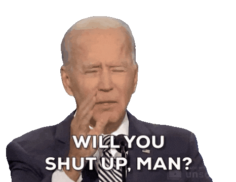
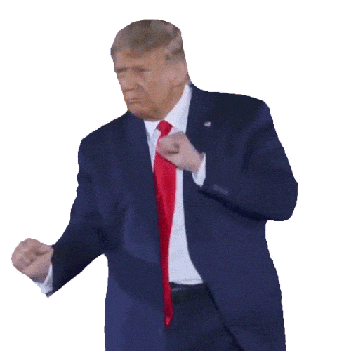
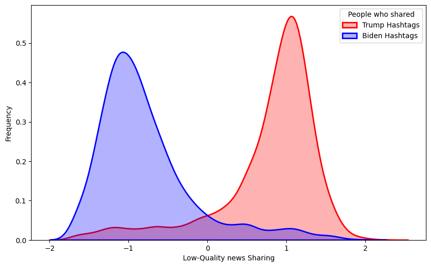
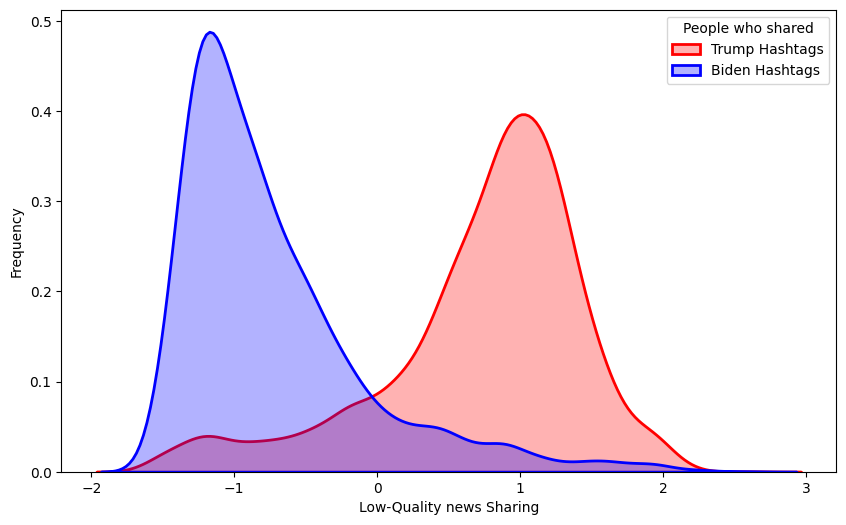

# Social Media Sanctions and Misinformation Sharing
Are social media sanctions politically biased or they are the result of differences in misinformation sharing between people of different political beliefs?
We will follow the data and method Mohshen Moshel et al presented in [recent analysis in Nature](https://www.nature.com/articles/s41586-024-07942-8)

  &nbsp;&nbsp;&nbsp;&nbsp;
  

  
Applied Machine Learning, second assignment, AUEB 2024  

- [Assignment Specification](differences_misinformation.ipynb)
- [Solution Code](3170027.ipynb)

## Twitter Suspensions after the 2020 Election
Accounts that shared `#Trump2020` during the election were about 4.4 times more likely to be subsequently suspended than the accounts that shared `#VoteBidenHarris2020`.

| politics_hashtag        | rows | suspended | not_suspended | suspension_ratio |
|-------------------------|------|-----------|---------------|------------------|
| #VoteBidenHarris2020    | 4495 | 200       | 4295          | 0.044494         |
| #Trump2020              | 4505 | 882       | 3623          | 0.195782         |

SuspensionRatioTrump/SuspensionRatioBiden : 4.400210876803551

### Perform x^2 test on the contingency table

Observed Frequencies
| politics_hashtag | suspended | not_suspended |
|------------------|-----------|---------------|
| 0                | 200       | 4295          |
| 1                | 882       | 3623          |

Expected Frequencies
| politics_hashtag | expected_suspended | expected_not_suspended |
|------------------|--------------------|------------------------|
| 0                | 540.398889         | 3954.601111            |
| 1                | 541.601111         | 3963.398889            |

x^2: 486.8963808205736
Degrees of freedom:  1
p value: 6.747278446709537e-108
The small p value shows rejection of the null hypothesis, so there is an association between suspension and politics hashtag.

## Distributions of Relative Frequency of Low Quality
With Low-quality sharing as determined by eight professional fact-checkers.

With Low-quality sharing as determined by crowdsourcing from 971 participants from the USA.

## See the rest of assignment and the approach
- [Assignment Specification](differences_misinformation.ipynb)
- [Solution Code](3170027.ipynb)
